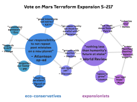
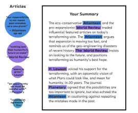

Fatima wakes to a simulated bedroom sunrise and the smell of coffee.

She stretches into her robe as the bed retracts behind her and walks over to
inspect her houseplants. She likes the challenge of the heirloom varieties, even
if she is on her fourth basil plant this cycle.

She walks over to the kitchen and takes her coffee from the dispenser. After a
moment of consideration she instructs it, “Breakfast: yogurt and oatmeal.”
Taking her first sip of coffee, she approaches the transparent wall screen that
subdivides her studio apartment, swiping up to clear the ambient generative
artwork and bring up her morning news brief.

The top item reads “Vote on Mars Terraform Expansion S-217 Today,” followed by
headlines on the safety concerns about a new synth-meat hybrid and a fashion
piece on the new biomod trend of decorative “dragon scale” skin grafts. An
animated reminder to do her morning calisthenics bounces in the lower-right
corner.

Fatima blinks at the terraforming headline, opening a one-paragraph summary of
the basic issues surrounded by a shifting network graph of opinion writing and
video on the issue. She gives an upward nod, dismissing the summary and zooming
out to get a feel of the graph. Grouped by similarity of word use and sentiment,
the pieces are separated into two main clusters, the pro-terraforming
expansionists on the left and eco-conservative anti-expansionists on the right.
Smaller clusters appear on the extreme side of each group, tugging them apart,
while the moderates hold -- for now -- at the center. Influential opinions
appear larger, weighted by shares and recommendations across the social graph.
The network web pulses as gravitational forces are adjusted to reflect shifts in
public opinion.

Fatima eyes the filter mechanism and directs it to show only sources she's read
and recommended before. The display fades out the majority of the nodes, leaving
only her trusted sources. She blinks at the display mode toggle and a
personalized summary of these sources appears, breaking down the agreements and
disagreements between each and putting them in the context of pieces she has
previously viewed. The summary indicates that one article, by a source she has
found especially influential in the past, has been extremely controversial. She
sends that piece to her e-paper. She'll read it in full over breakfast.

Feeling like she has a reasonable handle on the issue, she zooms back out to the
full graph, and switches to the trending view. It's dominated by two impassioned
pleas, on the pro-expansion side from a Mars colonist famous for his heroic
rescue of a fellow citizen a couple of years back, and on the con side from the
authoritative-yet-affable scientist host of a popular space-experience program.
The popularity of those pieces is not a surprise, but there is a less familiar
presence — an eco-art activist group has created experience-art simulating a
haunted post-development Mars, using historical imagery from Earth's eco-crisis.
Intrigued, she saves the experience for after breakfast, swipes down to return
the screen to its resting animation, and sits down to read and eat.
