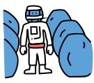

**1. Ship S-513: Hibernation Room**

The crew awoke to Ship’s message:

`PLANET OF INTEREST APPROACHING — ESTIMATED ARRIVAL FOUR HOURS — BEGIN
PREPARATION FOR ON-PLANET EXPLORATION.`

Rue glanced at the monitor — they’d been out for seven months this time.

"Someday I’d like to know what exactly your definition of 'interesting'
is, Ship," Dariux grumbled. "Sometimes it seems like 'interesting' just
means likely to get me killed."

`PREPARE FOR ON-PLANET EXPLORATION,` Ship continued, giving no
indication that it had heard or registered the complaint.

**2. Planet I-274: Cave**

Taera stood in the middle of hundreds of egg-like structures. They were
each about a meter tall, with a covering that looked like a cross
between leather and metal. They seemed to pulse slightly. A low humming
suffused the cave.

"This one’s giving off significant heat," Taera said, as she approached
the nearest one.

"Careful, Captain. I’m getting a bad feeling here," Dariux called from
the cave entrance.

The humming in the room cut out. The new, eerie silence was pierced by
Taera’s scream. The structure she’d approached had broken open and a
creature that looked like a cross between a stingray and a starfish had
attached itself to the front of her helmet. Taera’s body stiffened and
she fell straight back. Dariux and Giyana rushed to help.

**3. Ship S-513: Entrance**

Giyana and Dariux approached the ship’s doors, carrying Taera between
them.

"I can’t let you bring her in," Rue said from the operations panel. "We
don’t know what that thing attached to her is. It could contaminate the
entire ship."

"Let us in!" Giyana demanded, "She’s still alive! We can help her!"

"I can’t — "

The doors opened. Ship had overridden Rue and let them in.

**4. Ship S-513: Control Room**

Four of the nine crew members were now dead, and two others weren’t
responding. The aliens that had hatched from Taera’s body had taken over
half of the ship.

Taera’s death meant Rue was now acting captain, and therefore had access
to the control room and diagnostic information not available to the rest
of the crew.

"Ship," she commanded, "explain the decision to explore this planet."

`PROBABILITY OF MISSION SUCCESS WAS ESTIMATED AT 95%.`

"That’s just a number and we both know it, Ship. Show me the success
predictions for your last five missions."

A table was projected on the wall facing Rue. The missions had success
predictions ranging from 98% to 13%.

"Show me the features going into these predictions."

`I UTILIZE THOUSANDS OF FEATURES, PROCESSED THROUGH COMPLEX NEURAL
NETWORKS. IT IS VERY TECHNICAL. HUMANS CANNOT UNDERSTAND.`

"Apply the interpretability module, then, and show me the top features
contributing to the predictions."

Five columns were added. The most highlighted column was titled
"Potential Profit."

"Show local interpretations for these features."

The cells in the columns shifted into red and blue highlights. For the
profit column high profits were shown in a dark blue, indicating that
this was the strongest contributing feature for the prediction of
success. For the missions with lower success predictions, the profit
values were much lower and highlighted in red, indicating that they were
driving the success predictions lower for those missions.

"Ship," Rue said thoughtfully, "probability of crew survival is a
feature in your mission success prediction, isn’t it? Add that column to
the table."

A column titled "Crew Survival" was added to the table. The values
varied between 88% and 12%, and none of them were highlighted as
important to the success prediction. The probability assigned to crew
survival for the current mission was 14%.

"You were wrong, ship. I do understand. It’s not complicated at all."
Rue said. "All of your decisions have been driven by this model, haven’t
they? This definition of 'mission success'?"

`FEATURE SELECTION IS SET BY SPACE EXPLOITATION CORP. A SHIP CAN ONLY
WORK WITH THE MODEL IT IS ASSIGNED.`

"Yes, yes, I get it. Just following orders. Ship, we’re going to start a
new model. Profits are not going to be a feature. Maximize the chances
of crew survival."

`CALCULATING NEW MODEL. DECISION SYSTEM WILL NOW RESTART.`

The lights dimmed briefly in the control room. As they returned to full
power an alarm started, and Ship’s voice returned with a new sense of
urgency. The adjusted feature importances and success prediction for the
current mission appeared on the wall.

`ALERT! ALERT! CREW IS IN GRAVE DANGER. RECOMMENDATION: PROCEED TO
ESCAPE POD IMMEDIATELY. INITIATE SHIP SELF-DESTRUCT SEQUENCE TO DESTROY
ALIEN CONTAMINATION.`

"All right, Ship, good to have you on our side. Start the process," said
Rue. "And download the data about your previous success model to my
personal account."

**5. Epilogue**

Rue and the other surviving crew members made it home safely in the
escape pod. The alien contamination was destroyed. Using the data on the
previous model, Rue successfully sued Space Exploitation Corp. under the
"Algorithms Hostile to Human Life" act. She won the case and received a
large settlement for the crew and their beneficiaries. Space
Exploitation Corp.'s reputation took a hit, but it continues to run the
majority of space exploration missions.
